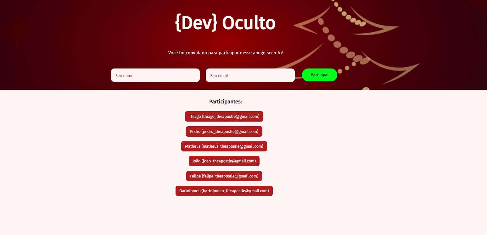
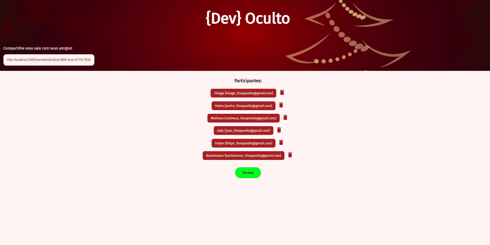

# dev-secret
A very simple app that reproduces the very popular Secret Santa for you to do with your family and friends. Was made with Serverless Architeture, MongoDB, ReactJs and NextJs.

# How to use
You can use git clone to copy this repository by typing this command on your console:
`` https://github.com/gustavonikov/dev-secret.git ``
or you can download the zip file and open it in your IDE.

### IMPORTANT!
The server of this project is offline, so you can use him on development mode or you can see the layout on the vercel link :) 

#### Below you can see the two pages that you won't be able to see because the server is offline:
 
First photo: Participants page, where you can register yourself after the admin sends the link to you.
 
Second photo: Admin page, where the admin can share the link to Secret Santa game, and he can also shuffle and start the game, or delete participants.
 

 

